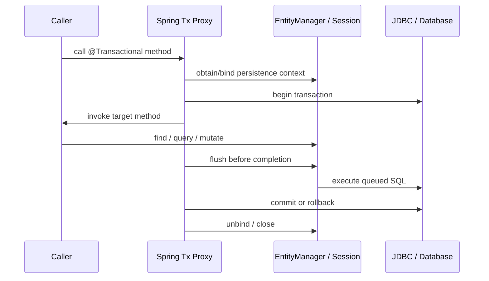

<nav class="page-nav">
[🏠 Home](/) &nbsp;|&nbsp; [Entity Lifecycle →](/docs/02-entity-lifecycle/)
</nav>

## 1. JPA versus Hibernate

## Specification, implementation, and Spring façade

| **Concept**               | **Precise role**                                                                                                                                                   | **Lifetime / scope**                                                                 |
|---------------------------|--------------------------------------------------------------------------------------------------------------------------------------------------------------------|--------------------------------------------------------------------------------------|
| Jakarta Persistence (JPA) | Specification: annotations, entity states, EntityManager API, JPQL, lifecycle rules, locking, flush modes. It is a contract, not an engine.                        | Portable programming model.                                                          |
| Hibernate ORM             | Provider implementing JPA plus native features: Session, HQL, filters, @DynamicUpdate, bytecode enhancement, provider flush modes, statistics, cache integrations. | Runtime engine.                                                                      |
| EntityManager             | JPA façade over one persistence context. find/persist/merge/remove/query/flush/clear. Not thread-safe.                                                             | Usually transaction-scoped in Spring.                                                |
| Session                   | Hibernate-native counterpart. EntityManager is commonly backed by Session; unwrap(Session.class) exposes provider APIs.                                            | Same underlying persistence context.                                                 |
| EntityManagerFactory      | Heavy, thread-safe factory; owns metadata, connection access integration, and provider services.                                                                   | One per persistence unit / application.                                              |
| SessionFactory            | Hibernate-native factory and service/cache owner; EntityManagerFactory can unwrap it.                                                                              | Application-wide.                                                                    |
| Spring Data JPA           | Repository abstraction and query derivation. Delegates to an EntityManager; does not replace JPA/Hibernate or define transaction semantics.                        | Repository proxies are singleton-safe because the injected EntityManager is a proxy. |

## Spring execution sequence

The injected @PersistenceContext EntityManager is usually a shared proxy. Each method call routes to the real EntityManager bound to the current thread/transaction. This is how singleton Spring beans can safely “hold” an EntityManager field without sharing one persistence context across concurrent requests.

| **BOUNDARY** @Transactional is normally applied by an AOP proxy. Self-invocation, non-proxied construction, or unsupported method visibility can bypass interception. The annotation does not make Kafka or HTTP calls atomic with the database. |
|--------------------------------------------------------------------------------------------------------------------------------------------------------------------------------------------------------------------------------------------------|

<nav class="page-nav page-nav-bottom">
[🏠 Home](/) &nbsp;|&nbsp; [Entity Lifecycle →](/docs/02-entity-lifecycle/)
</nav>
