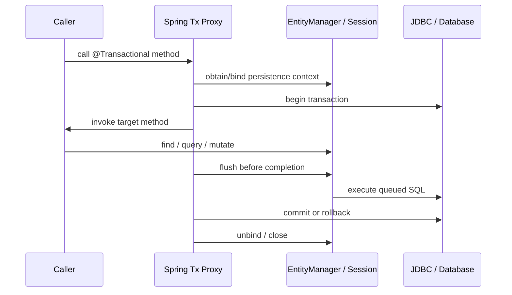

# Hibernate + JPA Internals

A payment-service field guide for Senior / Staff Java Backend interviews

Entity state • persistence context • dirty checking • flush • transactions • caching • loading • concurrency • performance

| **CORE MENTAL MODEL** A transaction is the database atomicity boundary. A persistence context is Hibernate’s in-memory unit of identity and change tracking. Flush synchronizes that state to SQL; commit makes the database transaction durable. |
|---------------------------------------------------------------------------------------------------------------------------------------------------------------------------------------------------------------------------------------------------|

Baseline: Jakarta Persistence 3.x concepts, Hibernate ORM 6.x behavior, Spring Framework / Spring Data JPA integration

## Contents

1. [JPA versus Hibernate](#1-jpa-versus-hibernate)
2. [Entity lifecycle](#2-entity-lifecycle-object-and-row-are-different-things)
3. [Persistence context and first-level cache](#3-persistence-context-and-mandatory-first-level-cache)
4. [Dirty checking](#4-dirty-checking-internals)
5. [Flushing](#5-flushing-synchronize-do-not-finalize)
6. [Second-level and query caches](#6-second-level-cache-l2-and-query-cache)
7. [Query behavior and loading](#7-query-behavior-and-loading)
8. [Relationships](#8-relationships-and-aggregate-correctness)
9. [Transactions and concurrency](#9-transactions-and-concurrency)
10. [Performance engineering](#10-performance-engineering)
11. [Payment-service execution traces](#11-payment-service-execution-traces)
12. [Comparison tables](#12-comparison-tables)
13. [Difficult interview questions](#13-twenty-difficult-interview-questions--with-answers)
14. [Predict the SQL exercises](#14-ten-predict-the-sql-and-outcome-exercises)
15. [Common production pitfalls](#15-common-production-pitfalls)
16. [Concise revision sheet](#16-concise-revision-sheet)

# How to use this guide

Read Chapters 1–5 in order; together they form the execution model. Then use the payment traces as a debugger’s view of the same ideas. The final interview questions, prediction exercises, pitfalls, and revision sheet are designed for active recall.

| **Layer**                | **Question it answers**                                                                 |
|--------------------------|-----------------------------------------------------------------------------------------|
| Spring transaction       | When is the EntityManager bound, when is the JDBC transaction committed or rolled back? |
| Persistence context / L1 | Which Java instance represents a database identity, and what changes are pending?       |
| Hibernate action queue   | Which INSERT/UPDATE/DELETE operations are scheduled and in what order?                  |
| JDBC / database          | Which SQL has executed, what locks/constraints apply, and what is durable?              |
| L2 / query cache         | Can state or identifiers be reused across persistence contexts?                         |

## Running domain model

```java
@Entity
class Payment {
    @Id
    @GeneratedValue(strategy = SEQUENCE)
    Long id;

    @Version
    long version;

    BigDecimal amount;
    PaymentStatus status;

    @ManyToOne(fetch = LAZY)
    FundingSource fundingSource;

    @OneToMany(mappedBy = "payment", cascade = ALL, orphanRemoval = true)
    List<PaymentAttempt> attempts = new ArrayList<>();
}

@Entity
class FundingSource {
    @Id Long id;
    String token;
    FundingStatus status;
}

@Entity
class PaymentAttempt {
    @Id Long id;
    @ManyToOne(fetch = LAZY) Payment payment;
    AttemptStatus status;
}
```

| **INTERVIEW HABIT** Always separate (1) object state, (2) persistence-context state, (3) SQL already sent, and (4) transaction durability. Most “Hibernate surprises” come from collapsing these into one concept. |
|--------------------------------------------------------------------------------------------------------------------------------------------------------------------------------------------------------------------|

# 1. JPA versus Hibernate

## Specification, implementation, and Spring façade

| **Concept**               | **Precise role**                                                                                                                                                   | **Lifetime / scope**                                                                 |
|---------------------------|--------------------------------------------------------------------------------------------------------------------------------------------------------------------|--------------------------------------------------------------------------------------|
| Jakarta Persistence (JPA) | Specification: annotations, entity states, EntityManager API, JPQL, lifecycle rules, locking, flush modes. It is a contract, not an engine.                        | Portable programming model.                                                          |
| Hibernate ORM             | Provider implementing JPA plus native features: Session, HQL, filters, @DynamicUpdate, bytecode enhancement, provider flush modes, statistics, cache integrations. | Runtime engine.                                                                      |
| EntityManager             | JPA façade over one persistence context. find/persist/merge/remove/query/flush/clear. Not thread-safe.                                                             | Usually transaction-scoped in Spring.                                                |
| Session                   | Hibernate-native counterpart. EntityManager is commonly backed by Session; unwrap(Session.class) exposes provider APIs.                                            | Same underlying persistence context.                                                 |
| EntityManagerFactory      | Heavy, thread-safe factory; owns metadata, connection access integration, and provider services.                                                                   | One per persistence unit / application.                                              |
| SessionFactory            | Hibernate-native factory and service/cache owner; EntityManagerFactory can unwrap it.                                                                              | Application-wide.                                                                    |
| Spring Data JPA           | Repository abstraction and query derivation. Delegates to an EntityManager; does not replace JPA/Hibernate or define transaction semantics.                        | Repository proxies are singleton-safe because the injected EntityManager is a proxy. |

## Spring execution sequence



The injected @PersistenceContext EntityManager is usually a shared proxy. Each method call routes to the real EntityManager bound to the current thread/transaction. This is how singleton Spring beans can safely “hold” an EntityManager field without sharing one persistence context across concurrent requests.

| **BOUNDARY** @Transactional is normally applied by an AOP proxy. Self-invocation, non-proxied construction, or unsupported method visibility can bypass interception. The annotation does not make Kafka or HTTP calls atomic with the database. |
|--------------------------------------------------------------------------------------------------------------------------------------------------------------------------------------------------------------------------------------------------|

# 2. Entity lifecycle: object and row are different things

| **State**            | **Java object / persistence context**                                                             | **Database row**                                                                                        |
|----------------------|---------------------------------------------------------------------------------------------------|---------------------------------------------------------------------------------------------------------|
| Transient            | Ordinary object; no persistence identity tracked by this context; may have an assigned id.        | Usually no row. Hibernate has no obligation to insert it.                                               |
| Managed / persistent | Present in identity map; changes tracked; exactly one managed instance per entity type + id.      | Row may already exist, or INSERT may only be scheduled. SQL timing depends on id generation and flush.  |
| Detached             | Has identity but is no longer tracked because of detach/clear/close/serialization/end of context. | Row remains. Mutating object alone does nothing.                                                        |
| Removed              | Still associated until flush but marked for deletion.                                             | DELETE is scheduled; row usually remains until flush and is recoverable by rollback after SQL executes. |

## Operations and transitions

| **Operation** | **Input state → result**                                                 | **Java-object effect**                                                                                                | **Row / SQL effect**                                                                                  |
|---------------|--------------------------------------------------------------------------|-----------------------------------------------------------------------------------------------------------------------|-------------------------------------------------------------------------------------------------------|
| persist(x)    | transient → managed                                                      | Same instance becomes managed. Cascades PERSIST. Error if detached identity conflicts.                                | INSERT scheduled; may execute early for IDENTITY or to obtain key, otherwise usually at flush.        |
| merge(x)      | transient/detached → x stays transient/detached; managed copy y returned | Hibernate finds/creates managed y and copies merge-cascaded state. Never assume x became managed.                     | SELECT may be needed; INSERT/UPDATE for y occurs on flush if needed.                                  |
| remove(x)     | managed → removed                                                        | x marked removed; cascade REMOVE may traverse graph.                                                                  | DELETE scheduled, ordered at flush; rollback restores DB, not necessarily safe reuse of object graph. |
| detach(x)     | managed → detached                                                       | Stops tracking x; pending dirty changes for x are lost unless already flushed. Cascade DETACH applies selectively.    | No row change by detach itself.                                                                       |
| refresh(x)    | managed → managed                                                        | Overwrites in-memory state from DB; pending local changes to refreshed attributes are lost. Cascade REFRESH possible. | SELECT executes; locking options may add lock.                                                        |
| clear()       | all managed/removed → detached                                           | Empties context and action associations; unflushed changes are discarded from tracking.                               | No SQL solely because of clear.                                                                       |
| close()       | context unusable; managed instances become detached                      | Releases persistence-context resources. Spring usually owns this.                                                     | Does not mean commit; transaction owner decides outcome.                                              |
| flush()       | states unchanged conceptually                                            | Synchronizes tracked changes/action queue. Objects remain managed.                                                    | Executes SQL but does not commit.                                                                     |
| find(T,id)    | none → managed or returns existing managed                               | Identity-map lookup first; may use L2, then DB.                                                                       | SELECT only on cache miss unless lock/refresh requires DB.                                            |

### The merge trap

```java
Payment detached = ...;
Payment managed = em.merge(detached);

assert detached != managed;          // normally true
detached.setStatus(APPROVED);         // not tracked
managed.setStatus(APPROVED);          // tracked
```

Spring Data JpaRepository.save chooses persist for a new entity and merge for a non-new entity (subject to its new-detection rules). Therefore save(existingDetached) returns the instance you should continue using. For an already managed entity, save is usually redundant; merge may still copy state and add overhead.

# 3. Persistence context and mandatory first-level cache

## Identity map

Hibernate stores managed entities under an EntityKey roughly equivalent to (entity persister/type, identifier). It also tracks loaded-state snapshots, entity status, version, collection wrappers, proxies, and queued actions. Calling this merely a “cache” understates its role: it is the unit of work and identity map.

| **JPA GUARANTEE** Within one persistence context, repeated access to the same persistent identity returns the same managed Java object (==), barring explicit detachment/clear or special projection/native cases. |
|--------------------------------------------------------------------------------------------------------------------------------------------------------------------------------------------------------------------|

| **Operation**                  | **L1 behavior**                                                                               | **Database behavior**                                                                                               |
|--------------------------------|-----------------------------------------------------------------------------------------------|---------------------------------------------------------------------------------------------------------------------|
| find(Payment.class, 42)        | Return existing managed instance if present.                                                  | No SELECT on L1 hit.                                                                                                |
| JPQL select p where p.id=42    | Query normally executes to determine result rows/ids; hydration resolves identity through L1. | SELECT usually executes, but result element is existing managed object; query row values do not blindly replace it. |
| getReference(Payment.class,42) | May create/return proxy associated with EntityKey.                                            | No SELECT until non-identifier state is accessed; missing row may fail then.                                        |
| refresh(payment)               | Bypasses ordinary “keep current state” behavior and overwrites it.                            | SELECT executes.                                                                                                    |
| clear() then find(42)          | L1 is empty; new managed instance created.                                                    | L2 or SELECT supplies state.                                                                                        |

## Why mandatory and why not shared

- Identity: two Java objects for one row in one unit of work would make dirty checking, relationships, cascades, and write ordering ambiguous.

- Repeatable application-level reference: even under READ COMMITTED, the same managed instance remains until refreshed/cleared; this is not the same as database repeatable-read semantics for arbitrary queries.

- Isolation: sharing mutable managed objects across requests would violate thread safety and transaction isolation. Therefore L1 is per EntityManager/Session, not SessionFactory-wide.

- Lifecycle correctness: snapshots and action queue belong to one unit of work and must be completed or abandoned together.

## Memory growth in batch jobs

Every loaded/inserted entity, snapshot, collection wrapper, and pending action consumes memory. Processing 100,000 rows in one context can become O(n) memory and make dirty checking O(n) at flush. Stream/page through rows, periodically flush and clear, avoid retaining references elsewhere, and control JDBC fetch size. StatelessSession is an advanced alternative when identity map, cascades, and dirty checking are unnecessary.

# 4. Dirty checking internals

## Snapshot-based algorithm

1.  Hydration: Hibernate reads a row and creates/populates the entity.

2.  Registration: the entity is placed in the persistence context under its EntityKey.

3.  Baseline: Hibernate retains loaded state (typically an Object\[\] of property values) and version/status metadata.

4.  Mutation: application changes fields directly; no repository call is required while the instance is managed.

5.  Flush traversal: Hibernate checks managed entities. For each dirty candidate, it compares current state with the baseline using Hibernate types/mutability rules.

6.  Scheduling: dirty properties produce an EntityUpdateAction; collection changes produce collection actions. Lifecycle callbacks/interceptors may participate.

7.  Execution: actions are ordered and translated to JDBC statements; the snapshot/version state is updated after successful execution.

## Bytecode enhancement and mutable values

With enhancement, field interception can mark which attributes changed (“self-dirty tracking”), reduce full comparisons, support lazy basic attributes, and improve association management. It does not remove flush semantics. Hibernate may still need snapshots for optimistic locking, mutable types, or correctness.

Mutable values are subtle. Replacing an immutable BigDecimal is easy to detect. Mutating a Date, byte array, embeddable, or custom mutable type in place requires Hibernate’s type system to deep-copy and compare correctly. A bad custom UserType/MutabilityPlan can hide changes or cause constant updates.

## SQL generation and @DynamicUpdate

Default UPDATE SQL is commonly pre-generated and sets all mapped updatable columns, even if only one changed. @DynamicUpdate generates SQL containing dirty columns at runtime. It can reduce writes and trigger/index churn for wide rows, but increases SQL-shape variety, statement-cache pressure, and per-flush work. @Version remains part of the predicate and is incremented.

```sql
-- typical optimistic update
UPDATE payment
SET amount = ?, status = ?, version = ?
WHERE id = ? AND version = ?;

-- affected rows == 0 => optimistic lock failure
```

## Read-only is not one universal switch

Spring @Transactional(readOnly=true) is primarily a hint/optimization. With Hibernate integration, Spring commonly sets a read-only-oriented flush mode and may mark the Session/default entities read-only, reducing snapshot/flush work. It is not a security boundary: the database may still allow writes, native SQL can still write, and behavior depends on transaction manager/provider/version. Enforce true read-only at database/connection/permissions where required.

| **COST MODEL** Dirty checking cost grows with the number of managed entities and properties considered, not merely the entities you intended to update. Keep persistence contexts intentionally sized. |
|--------------------------------------------------------------------------------------------------------------------------------------------------------------------------------------------------------|

# 5. Flushing: synchronize, do not finalize

## What flush does

Flush converts the in-memory unit of work into SQL required to make database state consistent with the persistence context: detect dirtiness, cascade relevant operations, validate transient references, order entity/collection actions, execute JDBC statements/batches, check row counts and optimistic versions, and surface many constraint errors. The transaction is still open.

| **Flush mode**   | **Meaning**                                                                                                    | **Important nuance**                                                                                      |
|------------------|----------------------------------------------------------------------------------------------------------------|-----------------------------------------------------------------------------------------------------------|
| JPA AUTO         | Provider must ensure queries that could be affected observe pending changes; provider may flush before commit. | Hibernate uses query-space overlap to decide whether an HQL/JPQL query needs an auto-flush.               |
| JPA COMMIT       | Flush is required at commit; query visibility of unflushed changes is unspecified.                             | Hibernate may delay query flush, but identity/L1 effects can still influence returned objects.            |
| Hibernate ALWAYS | Flush before every query.                                                                                      | Provider-specific and often more work than AUTO.                                                          |
| Hibernate MANUAL | Only explicit flush (or provider-specific explicit handling).                                                  | Dangerous in write flows; commit behavior can differ from ordinary JPA expectations when forced natively. |
| Hibernate AUTO   | Native counterpart of typical JPA AUTO behavior.                                                               | Native-query synchronization behavior depends on API and declared synchronized query spaces.              |

## Flush versus commit timeline

```mermaid
sequenceDiagram
    participant App
    participant PC as Persistence Context
    participant DB
    App->>PC: payment.setStatus(APPROVED)
    App->>PC: flush()
    PC->>DB: UPDATE ... WHERE id=? AND version=?
    Note over DB: SQL visible per isolation; locks may be held
    alt success path
        App->>DB: COMMIT
    else later exception
        App->>DB: ROLLBACK
    end
```

## Why SQL runs early and why flush fails

- A JPQL/HQL query whose query spaces overlap pending Payment changes may trigger AUTO flush so its database result is not stale relative to pending writes.

- Explicit flush is used to detect errors early, obtain database-generated effects, or bound a batch.

- IDENTITY key generation often requires an immediate INSERT to obtain the id; this is SQL execution, though the row is still uncommitted.

- Flush can fail on NOT NULL, UNIQUE, FK, CHECK, length/type errors, deadlocks/timeouts, optimistic row-count mismatch, trigger failures, or connection errors.

A caught flush exception generally leaves the Hibernate Session and transaction unusable. Mark/allow rollback; do not continue as if only one statement failed. At commit, Spring’s transaction manager invokes provider synchronization/flush before the actual JDBC commit. A flush failure causes rollback. SQL already executed during flush is rolled back if the transaction rolls back.

| **Dimension**               | **flush()**                                                     | **commit()**                                                                        |
|-----------------------------|-----------------------------------------------------------------|-------------------------------------------------------------------------------------|
| Purpose                     | Synchronize persistence context to database transaction.        | Finalize the transaction atomically.                                                |
| SQL                         | May issue INSERT/UPDATE/DELETE and acquire locks.               | May first trigger flush, then database COMMIT.                                      |
| Durability                  | No. Changes remain uncommitted.                                 | Yes after successful commit, subject to DB guarantees.                              |
| Rollback possible afterward | Yes.                                                            | No ordinary rollback after successful commit.                                       |
| Entity state                | Entities generally remain managed.                              | Transaction-scoped context ends; objects usually become detached after cleanup.     |
| Errors                      | Constraints, optimistic locks, batching, DB errors can surface. | Flush errors plus commit-time/deferred constraints/connection failures can surface. |

# 6. Second-level cache (L2) and query cache

## Architecture

L2 is optional and scoped to the EntityManagerFactory/SessionFactory. It stores disassembled entity state by entity type and id, not shared live Java objects. On an L2 hit, each persistence context assembles its own managed instance, preserving L1 isolation and identity.

| **Cache**     | **Key → value**                                                        | **Scope**                                     | **Invalidation / risk**                                                                            |
|---------------|------------------------------------------------------------------------|-----------------------------------------------|----------------------------------------------------------------------------------------------------|
| L1            | (entity type,id) → managed object + tracking metadata                  | One persistence context; mandatory            | Cleared/detached/closed locally; transaction-aware state.                                          |
| Entity L2     | (entity type,id) → cached attribute state/version                      | SessionFactory / configured cluster; optional | Writes update/invalidate region entries according to strategy. External writers can make it stale. |
| Collection L2 | (role,owner id) → element ids/keys                                     | SessionFactory / cluster                      | Caches membership, not necessarily element state; both collection and entity regions matter.       |
| Query cache   | query text/plan parameters/pagination/tenant/etc. → result ids/scalars | SessionFactory / cluster                      | Invalidated by timestamps/query spaces; result ids still resolve through L1/L2/DB.                 |

## Regions, providers, and strategies

- Regions partition cache entries by entity, collection, query, and update-timestamp concerns. Region configuration controls TTL, capacity, replication/distribution, and eviction.

- Providers integrate through Hibernate’s cache SPI/JCache ecosystem; examples historically include Ehcache, Infinispan, Hazelcast, and vendor/cloud products. Compatibility with your Hibernate major version matters.

| **Strategy**         | **Use**                                                                       | **Trade-off**                                                                      |
|----------------------|-------------------------------------------------------------------------------|------------------------------------------------------------------------------------|
| READ_ONLY            | Immutable reference data.                                                     | Fastest; updating cached entity is invalid.                                        |
| NONSTRICT_READ_WRITE | Rarely updated data tolerating a staleness window.                            | Invalidation around writes is not strict transactional coherence.                  |
| READ_WRITE           | Read-mostly mutable data requiring stronger soft-lock/timestamp coordination. | More cache traffic and complexity; not serializable isolation.                     |
| TRANSACTIONAL        | Provider supports transactional cache semantics.                              | Requires compatible transaction/cache integration; highest operational complexity. |

## Clustered deployments and payment guidance

Local per-node L2 caches require invalidation/replication across nodes or tolerate inconsistent reads until expiry. Distributed caches add serialization, network, split-brain, topology, and deployment-version concerns. Database writes performed outside Hibernate must also invalidate or expire cached state; otherwise the cache can serve stale data.

| **PAYMENT RECORDS** High-churn Payment and PaymentAttempt rows, strict freshness, status transitions, version checks, and write-heavy access often make them poor L2 candidates. Cache stable FundingSource metadata only if token/security policy, invalidation, tenant boundaries, and revocation freshness are designed explicitly. Never treat L2 as the authority for balances, idempotency, or authorization. |
|---------------------------------------------------------------------------------------------------------------------------------------------------------------------------------------------------------------------------------------------------------------------------------------------------------------------------------------------------------------------------------------------------------------------|

L2 helps when reads greatly outnumber writes, entity state is reused across many sessions, objects are small/stable, cache hit ratio is high, and invalidation is reliable. It is useless or harmful for one-off scans, high-cardinality cold data, write-heavy records, strict real-time truth, huge graphs, or queries that still hit the DB and rarely repeat.

# 7. Query behavior and loading

| **API**        | **Strength**                                                 | **Caution**                                                                                                              |
|----------------|--------------------------------------------------------------|--------------------------------------------------------------------------------------------------------------------------|
| JPQL/HQL       | Entity-oriented, portable JPQL; Hibernate HQL adds features. | Returns managed entities unless projection/read-only; still executes query even when matching entities are in L1.        |
| Criteria API   | Programmatic, composable, type-oriented with metamodel.      | Verbose; same persistence and loading semantics as JPQL.                                                                 |
| Native SQL     | DB-specific control and features.                            | Mapping/synchronization/cache invalidation are harder; AUTO flush behavior differs by API and synchronized query spaces. |
| DTO projection | Loads only selected data; no entity dirty checking.          | Not managed; cannot navigate lazy relationships as entities.                                                             |

## Lazy, eager, proxies, and initialization

LAZY means the association may be represented by a proxy or persistent collection wrapper and initialized when accessed. EAGER is a requirement that it be loaded by the time the entity is available, not necessarily one join; providers may issue secondary selects. To-one associations default EAGER in JPA, but production models often override to LAZY where provider enhancement/proxy constraints allow.

LazyInitializationException occurs when an uninitialized proxy/collection needs a Session but the entity is detached or the Session is closed. Fix the use-case boundary: fetch the required graph inside the transaction or project to a DTO. Open Session in View postpones the symptom and can hide accidental SQL, inconsistent reads, and connection/latency problems.

## N+1 and fetch tools

| **Technique**                         | **What it does**                                                               | **Limits**                                                                              |
|---------------------------------------|--------------------------------------------------------------------------------|-----------------------------------------------------------------------------------------|
| JOIN FETCH                            | Loads root + association in one SQL join.                                      | To-many duplicates rows; DISTINCT/entity de-dup; multiple bags and pagination problems. |
| EntityGraph                           | Declaratively selects attributes/associations for a use case.                  | Provider generates joins/secondary loads; inspect actual SQL.                           |
| @BatchSize / default_batch_fetch_size | When one proxy/collection initializes, fetches a batch of similar pending ids. | Reduces N+1 to roughly N/batch; not one query and requires a useful access pattern.     |
| SUBSELECT fetching                    | Loads collections for owners returned by prior query using a subselect.        | Hibernate-specific and context-sensitive.                                               |
| DTO projection                        | Fetches exact columns/aggregation.                                             | No managed graph; best for read APIs.                                                   |

## Pagination with collection fetch joins

A collection join multiplies database rows, while pagination is supposed to count root entities. Applying LIMIT/OFFSET at the SQL row level can truncate a root’s collection or return fewer roots; Hibernate may warn or paginate in memory, which is dangerous. Use two-phase pagination: first page Payment ids with stable ordering, then fetch the graph for those ids; or use keyset pagination and a second fetch.

# 8. Relationships and aggregate correctness

## Owning side and mappedBy

The owning side is the mapping that writes the FK/join table. mappedBy names the Java property on the owning side; it does not mean “parent.” For Payment(1)–PaymentAttempt(many), the @ManyToOne PaymentAttempt.payment usually owns payment_id. Payment.attempts is inverse with mappedBy="payment". Changing only the inverse collection does not reliably update the FK; helper methods must update both sides in memory.

```java
void addAttempt(PaymentAttempt attempt) {
    attempts.add(attempt);
    attempt.setPayment(this);
}

void removeAttempt(PaymentAttempt attempt) {
    attempts.remove(attempt);
    attempt.setPayment(null);
}
```

| **Mapping**         | **Typical physical model**                   | **Main warning**                                                                          |
|---------------------|----------------------------------------------|-------------------------------------------------------------------------------------------|
| @ManyToOne          | FK on many-side table.                       | Default EAGER in JPA; set LAZY intentionally. Owning side writes FK.                      |
| @OneToMany mappedBy | Inverse collection; FK lives on child.       | Initialize collection; update both sides; avoid unbounded eager load.                     |
| @OneToOne           | Unique FK or shared primary key via @MapsId. | Choose owner deliberately; optional/proxy behavior can force loads.                       |
| @ManyToMany         | Join table containing both FKs.              | Often hides a real domain entity with attributes; use explicit link entity when possible. |

## Cascade versus orphan removal

Cascade propagates an EntityManager operation across an object graph; it is not database cascade and not a fetch setting. PERSIST, MERGE, REMOVE, REFRESH, DETACH, ALL should follow aggregate ownership. Cascade REMOVE across shared entities (especially many-to-many) is dangerous. orphanRemoval=true means a privately owned child removed from the relationship is scheduled for deletion, not merely FK nulling. It is appropriate for PaymentAttempt only if attempts cannot exist independently and history-retention rules permit deletion—which payment audit records often do not.

## equals/hashCode

- Database-generated ids are null before persist and later assigned; hashing on id can change while an entity is inside a HashSet.

- Reference equality is stable but detached copies representing the same row compare unequal.

- Business keys can work if immutable, unique, and available at construction; mutable fields must not participate.

- Proxies complicate getClass(); use a proxy-safe strategy consistent with your provider and inheritance. Never include lazy associations/collections in equals, hashCode, or toString.

# 9. Transactions and concurrency

## Spring @Transactional and Hibernate

8.  Caller crosses the Spring proxy. The interceptor resolves a PlatformTransactionManager.

9.  JpaTransactionManager obtains/creates an EntityManager, binds it to the thread, obtains a JDBC connection through the provider, and begins the transaction.

10. Repositories and @PersistenceContext proxies resolve the bound EntityManager, so they share one persistence context.

11. Business code loads and mutates managed entities. SQL may execute immediately for reads/identity keys, at query auto-flush, explicit flush, or completion.

12. On normal return, synchronization flushes; the manager commits; resources are unbound/closed. On configured rollback exceptions, it rolls back.

13. Default Spring rollback rules: unchecked RuntimeException/Error roll back; checked exceptions do not unless configured. An inner REQUIRED participant marking rollback-only can cause UnexpectedRollbackException at the outer commit.

## Optimistic locking

@Version adds the loaded version to UPDATE/DELETE predicates. Two transactions may both read version 7. First commits UPDATE ... version=8 WHERE id=? AND version=7. Second affects zero rows at flush and receives OptimisticLockException / StaleObjectStateException, commonly translated by Spring. Retry the entire business transaction only if the operation is safe and bounded; reload and revalidate external assumptions.

## Pessimistic locking

PESSIMISTIC_WRITE generally issues SELECT ... FOR UPDATE (dialect-specific), holding a database lock until transaction completion. It serializes contenders but can deadlock, time out, reduce throughput, and lock more rows than expected depending on query/index plan. Hibernate’s L1 state does not itself lock the database. A lock request on an already managed entity may still require SQL to acquire/upgrade the database lock.

## Lost update, write skew, and isolation

| **Anomaly**         | **Example**                                                                                                                           | **Defense**                                                                                                 |
|---------------------|---------------------------------------------------------------------------------------------------------------------------------------|-------------------------------------------------------------------------------------------------------------|
| Lost update         | T1 and T2 read Payment v7; both write status; last writer wins without version predicate.                                             | @Version, atomic conditional UPDATE, or pessimistic lock.                                                   |
| Write skew          | Two transactions update different rows after checking a cross-row invariant, e.g., total daily funding limit remains below threshold. | SERIALIZABLE, explicit predicate/advisory locking, materialized invariant row, or atomic constraint/design. |
| Non-repeatable read | Same row read twice yields different committed values.                                                                                | REPEATABLE READ or explicit lock; L1 may mask repeated find but not arbitrary query semantics.              |
| Phantom             | Re-running predicate query returns new rows.                                                                                          | Database-specific REPEATABLE READ/SERIALIZABLE behavior; predicate/range locks or redesign.                 |

READ COMMITTED prevents dirty reads but does not inherently prevent lost updates or write skew. REPEATABLE READ names differ by database implementation. SERIALIZABLE is strongest but can abort transactions and requires retry. Hibernate cannot upgrade weak database isolation merely by tracking objects.

## Bulk DML bypasses managed state

JPQL UPDATE/DELETE and native DML operate directly in the database. They do not run per-entity dirty checking, cascades, lifecycle callbacks, or automatically update already managed objects. Hibernate normally auto-flushes relevant pending entity work before bulk DML, executes it, and may invalidate affected L2/query regions, but L1 objects remain stale. Use @Modifying(clearAutomatically=true), explicit clear(), or run bulk work in a deliberately isolated context. Beware: clearing discards other unflushed changes unless flushed first.

# 10. Performance engineering

| **Lever**                  | **Mechanism**                                                                        | **Failure mode / measurement**                                                                                 |
|----------------------------|--------------------------------------------------------------------------------------|----------------------------------------------------------------------------------------------------------------|
| JDBC batching              | hibernate.jdbc.batch_size groups same-shape DML; driver sends batches.               | IDENTITY inserts and mixed SQL shapes reduce batching; verify driver metrics/logs, not just config.            |
| Insert/update ordering     | order_inserts/order_updates groups statements by entity/key.                         | Sorting overhead; can change lock order beneficially but never rely on incidental ordering for business logic. |
| flush + clear batching     | Every N records flush SQL, then detach all to bound memory.                          | clear detaches references; exceptions invalidate transaction; one giant transaction still holds locks/log.     |
| SEQUENCE allocation        | Preallocates id blocks; supports batched inserts.                                    | allocationSize must align with sequence strategy; gaps are normal.                                             |
| IDENTITY                   | DB generates id on INSERT.                                                           | Often forces immediate per-row INSERT and disables effective insert batching.                                  |
| Connection pool            | Persistence context usually acquires/holds connection around transactional DB work.  | Long transactions, remote calls, nested REQUIRES_NEW, or streaming exhaust pool.                               |
| JDBC fetch size            | Hints rows fetched per network round trip for large result sets.                     | Not association batch size; driver/database semantics vary.                                                    |
| Hibernate batch fetch size | Batches lazy proxy/collection loads by identifiers.                                  | Does not control JDBC network fetch buffering.                                                                 |
| Plan/index                 | SQL shape, predicates, join order, cardinality, indexes dominate DB time.            | ORM tuning cannot rescue scans, bad indexes, parameter skew, or lock contention.                               |
| SQL observability          | Statement count, bind values safely, timings, rows, plans, Hibernate statistics/APM. | Raw show_sql in production is noisy and may leak sensitive data.                                               |

## Detecting unnecessary SQL

- Assert query counts in integration tests for critical endpoints; inspect N+1 under realistic graph access.

- Enable Hibernate statistics selectively; correlate slow traces with SQL, connection wait, row count, and flush events.

- Look for repeated selects, full-column updates, unexpected eager loads, selects caused by merge, collection delete/reinsert, and premature flushes.

- Use EXPLAIN/EXPLAIN ANALYZE safely on representative parameter values and data volumes. Index foreign keys and high-selectivity predicates based on workload, not annotations alone.

# 11. Payment-service execution traces

Assumptions unless stated: transaction-scoped persistence context; FlushMode.AUTO; Payment is versioned; L2 disabled except the explicit L2 scenario; PostgreSQL-like database; SEQUENCE ids. “L1” entries are abbreviated P42 → Payment#42.

## 11.1 Loading the same entity twice in one transaction

| **Line** | **Application action**   | **Entity state / L1**                         | **L2**        | **SQL / flush / outcome**                        |
|----------|--------------------------|-----------------------------------------------|---------------|--------------------------------------------------|
| 1        | @Transactional begins    | L1 = {}                                       | none          | BEGIN; no entity SQL.                            |
| 2        | p1 = em.find(Payment,42) | p1 managed; L1={P42→p1}                       | miss/disabled | SELECT payment ... WHERE id=42.                  |
| 3        | p2 = em.find(Payment,42) | same managed instance; p1 == p2; L1 unchanged | not consulted | No SELECT.                                       |
| 4        | method returns           | dirty check: unchanged                        | none          | No DML; COMMIT; context closes → p1/p2 detached. |

| **RESULT** L1 is an identity map, not merely a result cache. Repeated find returns the identical Java reference. |
|------------------------------------------------------------------------------------------------------------------|

## 11.2 Modifying a managed entity without save()

| **Line** | **Application action** | **Entity state / L1**                        | **L2**                                | **SQL / flush / outcome**                                   |
|----------|------------------------|----------------------------------------------|---------------------------------------|-------------------------------------------------------------|
| 1        | begin + find P42       | P42 managed; snapshot status=PENDING         | miss                                  | SELECT.                                                     |
| 2        | p.setStatus(APPROVED)  | P42 managed; current differs from snapshot   | none                                  | No UPDATE yet.                                              |
| 3        | return from method     | flush dirty-checks P42; update action queued | L2 invalidated/updated if enabled     | UPDATE payment SET ... version=8 WHERE id=42 AND version=7. |
| 4        | commit                 | P42 managed until cleanup                    | strategy completes cache coordination | COMMIT; object becomes detached after context close.        |

| **RESULT** save() is unnecessary for a managed entity. Dirty checking plus transaction completion causes the update. |
|----------------------------------------------------------------------------------------------------------------------|

## 11.3 Calling save() and then flush()

| **Line** | **Application action**    | **Entity state / L1**                                                          | **L2**                   | **SQL / flush / outcome**                                              |
|----------|---------------------------|--------------------------------------------------------------------------------|--------------------------|------------------------------------------------------------------------|
| 1        | p = repo.findById(42)     | managed P42                                                                    | possible lookup          | SELECT or cache hit.                                                   |
| 2        | p.status=APPROVED         | managed dirty                                                                  | none                     | No SQL.                                                                |
| 3        | repo.save(p)              | still same managed P42; Spring Data may call merge depending API/new detection | none                     | Usually no UPDATE yet; merge on already managed instance is redundant. |
| 4        | repo.flush() / em.flush() | dirty snapshot reconciled                                                      | cache write coordination | UPDATE executes; constraint/version errors surface now.                |
| 5        | later method returns      | remains managed                                                                | none                     | COMMIT; flush did not commit.                                          |

| **RESULT** saveAndFlush is not “save permanently.” It synchronizes now, and the transaction can still roll back. |
|------------------------------------------------------------------------------------------------------------------|

## 11.4 Flush followed by rollback

| **Line** | **Application action** | **Entity state / L1**                                   | **L2**                              | **SQL / flush / outcome**                               |
|----------|------------------------|---------------------------------------------------------|-------------------------------------|---------------------------------------------------------|
| 1        | load and mutate P42    | managed dirty                                           | none                                | SELECT, then no DML yet.                                |
| 2        | em.flush()             | managed; snapshot/action state synchronized             | cache strategy protects/invalidates | UPDATE executes; row is uncommitted; locks may be held. |
| 3        | throw RuntimeException | transaction marked rollback-only                        | cache coordination aborts           | ROLLBACK.                                               |
| 4        | cleanup                | object usually detached and still says APPROVED in Java | no committed new entry              | DB row remains prior status/version.                    |

| **RESULT** Rollback restores database state, not the fields of the Java object. Do not return or reuse it as authoritative state. |
|-----------------------------------------------------------------------------------------------------------------------------------|

## 11.5 Loading in two separate transactions

| **Line** | **Application action** | **Entity state / L1** | **L2**                   | **SQL / flush / outcome**               |
|----------|------------------------|-----------------------|--------------------------|-----------------------------------------|
| 1        | Tx A find(42)          | L1A={P42→a}           | possible miss/hit        | SELECT/cache assembly.                  |
| 2        | Tx A commit/close      | a detached; L1A gone  | entry may remain         | COMMIT.                                 |
| 3        | Tx B find(42)          | L1B={P42→b}; b != a   | possible hit             | L2 hit avoids SELECT; otherwise SELECT. |
| 4        | Tx B ends              | b detached            | entry remains per policy | COMMIT.                                 |

| **RESULT** Identity equality is guaranteed only inside one persistence context. Across transactions, instances normally differ even when ids match. |
|-----------------------------------------------------------------------------------------------------------------------------------------------------|

## 11.6 Concurrent update with @Version

| **Line** | **Application action**   | **Entity state / L1**            | **L2**                                      | **SQL / flush / outcome**                                                      |
|----------|--------------------------|----------------------------------|---------------------------------------------|--------------------------------------------------------------------------------|
| 1        | T1 and T2 find P42 v7    | separate L1s: a(v7), b(v7)       | L2 may supply v7 to each                    | Each obtains same committed version.                                           |
| 2        | T1 approves; T2 declines | both managed dirty independently | none                                        | No update until each flush.                                                    |
| 3        | T1 flush + commit        | a becomes v8                     | L2 updated/invalidated                      | UPDATE ... WHERE id=42 AND version=7 → 1 row; COMMIT.                          |
| 4        | T2 flush                 | b expected v7                    | cache not allowed to legitimize stale write | UPDATE ... WHERE id=42 AND version=7 → 0 rows; optimistic exception; ROLLBACK. |

| **RESULT** @Version converts silent last-writer-wins into a detectable conflict at flush. Retry must re-run the whole decision on fresh data. |
|-----------------------------------------------------------------------------------------------------------------------------------------------|

## 11.7 JPQL after changing a managed entity

| **Line** | **Application action**                                        | **Entity state / L1**                          | **L2**                                              | **SQL / flush / outcome**                                        |
|----------|---------------------------------------------------------------|------------------------------------------------|-----------------------------------------------------|------------------------------------------------------------------|
| 1        | find P42 then set status=APPROVED                             | P42 managed dirty                              | none                                                | SELECT only.                                                     |
| 2        | execute JPQL: select p from Payment p where p.status=APPROVED | AUTO evaluates overlapping Payment query space | none                                                | Auto-flush UPDATE first.                                         |
| 3        | execute query                                                 | L1 still maps P42 to same object               | query cache typically bypass/invalidated for writes | SELECT ... WHERE status=APPROVED; hydration reuses P42 instance. |
| 4        | commit                                                        | managed until close                            | cache coordination completes                        | COMMIT.                                                          |

| **RESULT** AUTO flush makes the database query reflect pending Payment changes. A query on an unrelated entity may not trigger a flush in Hibernate AUTO. |
|-----------------------------------------------------------------------------------------------------------------------------------------------------------|

## 11.8 Bulk update while an older entity remains in L1

| **Line** | **Application action**                               | **Entity state / L1**                                                                   | **L2**                                | **SQL / flush / outcome**                                                                                          |
|----------|------------------------------------------------------|-----------------------------------------------------------------------------------------|---------------------------------------|--------------------------------------------------------------------------------------------------------------------|
| 1        | p=find P42, status=PENDING                           | L1={P42 pending}                                                                        | possible read                         | SELECT.                                                                                                            |
| 2        | JPQL update Payment p set p.status=EXPIRED where ... | p remains managed with old field                                                        | affected L2/query regions invalidated | Bulk UPDATE executes directly; count returned.                                                                     |
| 3        | read p.getStatus()                                   | still PENDING in Java                                                                   | L2 irrelevant because L1 wins         | No SELECT.                                                                                                         |
| 4        | later dirty change/flush                             | stale p can overwrite fields; version behavior depends on bulk statement/version update | none                                  | Potential lost overwrite or optimistic behavior; bulk DML does not automatically increment version unless written. |
| 5        | em.clear(); find again                               | old p detached; new managed instance                                                    | cache must be invalidated             | SELECT returns EXPIRED.                                                                                            |

| **RESULT** Flush pending work first if needed, run bulk DML, then clear or refresh. Prefer bulk statements that update version where concurrency requires it. |
|---------------------------------------------------------------------------------------------------------------------------------------------------------------|

## 11.9 Reading an entity from L2 cache

| **Line** | **Application action** | **Entity state / L1**                       | **L2**                                | **SQL / flush / outcome**                           |
|----------|------------------------|---------------------------------------------|---------------------------------------|-----------------------------------------------------|
| 1        | new Tx; find P42       | L1 empty                                    | lookup entity-region P42 → hit        | No payment SELECT.                                  |
| 2        | assemble entity        | L1={P42→p}; p is a new per-session instance | cached disassembled state copied      | No SQL; lazy associations remain separate concerns. |
| 3        | find P42 again         | same p returned from L1                     | not consulted again                   | No SQL.                                             |
| 4        | commit                 | p detached                                  | L2 entry survives according to policy | COMMIT.                                             |

| **RESULT** L2 never shares a live managed object. It supplies state used to create a distinct managed instance inside the current L1. |
|---------------------------------------------------------------------------------------------------------------------------------------|

## 11.10 Processing 100,000 entities in a batch

| **Line** | **Application action**          | **Entity state / L1**                     | **L2**                        | **SQL / flush / outcome**                                                                             |
|----------|---------------------------------|-------------------------------------------|-------------------------------|-------------------------------------------------------------------------------------------------------|
| 1        | stream/page ids; batch size=500 | L1 starts empty                           | disable/bypass cache for scan | SELECT pages/stream with fetch-size.                                                                  |
| 2        | for each payment mutate         | L1 and snapshots grow toward 500          | avoid polluting L2            | No UPDATE until flush threshold.                                                                      |
| 3        | every 500: em.flush()           | dirty-check ≤500; execute batches         | invalidate relevant entries   | Batched UPDATEs; still uncommitted if one transaction.                                                |
| 4        | every 500: em.clear()           | L1 becomes {}; prior references detached  | none                          | No SQL from clear.                                                                                    |
| 5        | repeat to 100k                  | bounded context memory                    | none                          | Many batches.                                                                                         |
| 6        | commit/chunk commit             | single commit or safer chunk transactions | none                          | One giant transaction has huge undo/WAL/locks and all-or-nothing failure; chunking changes atomicity. |

| **RESULT** flush+clear bounds Hibernate memory, not transaction-log/lock duration. Choose transaction chunking based on restartability, idempotency, and atomicity requirements. |
|----------------------------------------------------------------------------------------------------------------------------------------------------------------------------------|

# 12. Comparison tables

## L1 versus L2 versus query cache

| **Property**       | **L1 / persistence context**                                | **L2 entity/collection cache**                     | **Query cache**                                       |
|--------------------|-------------------------------------------------------------|----------------------------------------------------|-------------------------------------------------------|
| Required           | Yes                                                         | No                                                 | No                                                    |
| Scope              | EntityManager / Session                                     | EntityManagerFactory / SessionFactory / cluster    | SessionFactory / cluster                              |
| Stores             | Live managed instances + snapshots/actions                  | Disassembled entity state or collection membership | Result ids/scalars keyed by query inputs              |
| Checked by find    | First                                                       | After L1 miss                                      | No                                                    |
| JPQL avoids DB?    | Usually no; query still executes                            | Not by itself                                      | Possible exact cache hit                              |
| Object identity    | Guarantees == within context                                | No shared objects; L1 assembles identity           | Returned entity ids resolve through L1/L2             |
| Transactional role | Unit of work                                                | Optimization with concurrency strategy             | Optimization with invalidation timestamps             |
| Staleness          | Can be stale after bulk/external update until refresh/clear | Can be stale with bad invalidation/external writes | Can be stale/low-hit; invalidated by affected spaces  |
| Best use           | All entity work                                             | Stable read-mostly reused data                     | Repeated identical expensive queries with stable data |
| Clear/evict        | clear/detach/close                                          | Region/entity eviction APIs                        | Query-region eviction                                 |

## Flush versus commit

| **Question**                   | **Flush**                                                          | **Commit**                                        |
|--------------------------------|--------------------------------------------------------------------|---------------------------------------------------|
| What boundary?                 | ORM-to-database synchronization inside transaction                 | Database transaction completion                   |
| Can DML execute?               | Yes                                                                | Yes; usually flushes first                        |
| Visible to other transactions? | Depends on isolation; normally uncommitted changes are not visible | Yes after success                                 |
| Can rollback undo it?          | Yes                                                                | Not after successful commit                       |
| Can constraints fail?          | Yes; immediate constraints and DB errors                           | Yes; deferred constraints and commit failures too |
| Does L1 close?                 | No                                                                 | Often after transaction-scoped cleanup            |
| Who triggers it?               | Explicit call, AUTO query, provider synchronization                | Transaction manager / resource transaction        |

# 13. Twenty difficult interview questions — with answers

### 1. Why does a JPQL query still hit the database when the entity is already in L1?

L1 indexes entities by identity; it is not a general predicate index. The database must determine which ids match. Hibernate then resolves matching ids through L1 so an existing managed instance is reused.

### 2. Can find() return stale data under READ COMMITTED?

Yes. If the entity is already managed, find returns it without re-reading. READ COMMITTED governs database reads; L1 identity semantics can mask a newer committed row until refresh/clear/new context.

### 3. Is flush equivalent to commit?

No. Flush executes synchronization SQL in the open transaction. Commit makes it durable. A later rollback reverses flushed SQL.

### 4. Why might persist execute INSERT immediately?

IDENTITY ids require the database INSERT to produce the key; some transaction/flush circumstances also require early SQL. With pooled SEQUENCE, Hibernate can assign ids without inserting and batch later.

### 5. Why is merge commonly misunderstood?

It copies state into a managed instance and returns that instance. The argument remains detached/transient. Continuing to mutate the argument is not tracked.

### 6. Why can save() be redundant?

A managed entity is automatically dirty-checked. JpaRepository.save is useful for new/detached instances but is not the trigger for updating an already managed entity.

### 7. What exactly does @Version prevent?

It detects conflicting writes to the same versioned row by adding version to DML predicates. It does not automatically protect cross-row invariants or prevent write skew.

### 8. Does L2 cache violate transaction isolation?

It can introduce stale reads if misconfigured, but it does not share live objects. Concurrency strategies and invalidation coordinate entries; the database remains authoritative. Strict requirements may justify disabling L2.

### 9. Why can @Transactional(readOnly=true) improve performance?

Hibernate integration can reduce flush/dirty-check snapshot work and choose a read-oriented flush mode. It is a hint, not guaranteed write prevention.

### 10. What happens if you catch a constraint exception from flush?

The transaction is normally marked rollback-only or the Session is inconsistent. Do not continue using it; roll back. The database may have rejected a batch after partial statement execution within the transaction.

### 11. Why can an eager mapping still produce N+1?

EAGER promises availability, not join syntax. Hibernate may load roots first and issue secondary selects per association, especially with JPQL that does not fetch join.

### 12. Why is collection fetch-join pagination dangerous?

The SQL result has one row per root-child pair, while pagination counts SQL rows. Results may be incomplete or paginated in memory. Page ids first, then fetch the graph.

### 13. What does bulk JPQL bypass?

Per-entity state, dirty checking, callbacks, cascades, and L1 synchronization. It directly updates rows and can leave managed entities stale.

### 14. L1 cache versus database repeatable read?

L1 guarantees one Java instance per identity and reuses its state. It does not make predicate queries repeatable or prevent phantoms; database isolation controls those.

### 15. Can clear() lose data?

Yes. It detaches all entities. Unflushed in-memory changes are no longer tracked. Flush before clear if those changes must reach the transaction.

### 16. What is cached for a collection region?

Usually collection membership—element ids/keys—keyed by owner and role. Element attributes come from their entity regions or database.

### 17. How can REQUIRES_NEW exhaust the connection pool?

The outer transaction may retain its connection while the inner independent transaction needs another. Concurrent threads can each hold one and wait for another, so the pool must account for nested demand or the design must change.

### 18. Why can @DynamicUpdate hurt?

It creates many SQL shapes based on dirty-column combinations, reducing statement/plan cache reuse and adding runtime generation work. Benefits are workload-dependent.

### 19. Why does flush order differ from code order?

Hibernate queues actions and orders them to satisfy FK constraints and improve batching. The action queue, not source-line order, determines much DML execution order.

### 20. How would you debug “Hibernate issued an update I did not expect”?

Capture transaction/flush boundaries and SQL with binds safely; inspect managed graph mutations, setters/listeners, mutable types, cascades, collection changes, merge copying, and dirty snapshots/statistics. Reproduce with a query-count integration test.

# 14. Ten “predict the SQL and outcome” exercises

## Exercise 1

Within one transaction: find(Payment,42); find(Payment,42). L2 off.

| **ANSWER** One SELECT. Same Java instance returned. No DML if unchanged; commit. |
|----------------------------------------------------------------------------------|

## Exercise 2

find P42; set status APPROVED; execute JPQL count(Payment p where p.status=APPROVED), AUTO.

| **ANSWER** SELECT to load; UPDATE auto-flushed before COUNT because query space overlaps; COUNT sees change inside same transaction; then commit. |
|---------------------------------------------------------------------------------------------------------------------------------------------------|

## Exercise 3

persist new Payment with SEQUENCE allocation; print id; rollback before explicit flush.

| **ANSWER** Sequence/id allocation SQL may occur; INSERT may not. Transaction rolls back; sequence numbers normally are not rolled back, so gap possible. |
|----------------------------------------------------------------------------------------------------------------------------------------------------------|

## Exercise 4

persist new Payment with IDENTITY; print id; then rollback.

| **ANSWER** INSERT usually executes immediately to obtain id. Rollback removes row, but generated identity value may be consumed. |
|----------------------------------------------------------------------------------------------------------------------------------|

## Exercise 5

load P42; detach(p); mutate p; commit.

| **ANSWER** SELECT only. Mutation is untracked; no UPDATE. DB unchanged. |
|-------------------------------------------------------------------------|

## Exercise 6

load P42; bulk JPQL sets all pending payments expired; immediately return p.status.

| **ANSWER** Bulk UPDATE executes (after relevant auto-flush). p can still report PENDING from L1. Commit stores EXPIRED unless a later stale managed flush overwrites it. |
|--------------------------------------------------------------------------------------------------------------------------------------------------------------------------|

## Exercise 7

T1/T2 load version 3. T1 flushes update but has not committed; T2 updates same row with PESSIMISTIC_WRITE request.

| **ANSWER** T1 holds row lock after UPDATE. T2’s lock/update waits or times out. After T1 commits, optimistic/version conditions determine whether T2 can update. |
|------------------------------------------------------------------------------------------------------------------------------------------------------------------|

## Exercise 8

Repository method without outer transaction loads Payment with lazy attempts; controller accesses attempts after return.

| **ANSWER** Repository read transaction/context ends; root SELECT occurred. Access triggers LazyInitializationException unless initialized, OSIV keeps context open, or mapping was fetched. |
|---------------------------------------------------------------------------------------------------------------------------------------------------------------------------------------------|

## Exercise 9

Loop persist 1000 SEQUENCE entities; batch_size=50; never flush until commit.

| **ANSWER** Ids allocated in blocks; L1/action queue holds 1000. At commit, inserts can execute in JDBC batches (subject to ordering/SQL shape). Memory remains O(1000). |
|-------------------------------------------------------------------------------------------------------------------------------------------------------------------------|

## Exercise 10

L2 has P42 v5. External SQL updates row to v6 without cache eviction; new context find(P42).

| **ANSWER** Potential L2 hit returns stale v5 without SELECT. A subsequent versioned UPDATE using v5 affects zero rows and fails optimistically; a read-only response may silently serve stale state. |
|------------------------------------------------------------------------------------------------------------------------------------------------------------------------------------------------------|

# 15. Common production pitfalls

- Long @Transactional methods perform HTTP/Kafka calls while holding connections and row locks; local DB rollback cannot undo remote side effects. Use outbox/inbox, idempotency, sagas, and narrow transaction boundaries.

- Self-invocation bypasses the Spring transaction proxy, so the expected propagation/readOnly/isolation does not apply.

- Catching an inner REQUIRED exception and continuing even though the shared transaction is rollback-only, leading to UnexpectedRollbackException later.

- Using REQUIRES_NEW per item while outer transactions hold connections, causing pool starvation.

- Returning entities directly from APIs, triggering lazy loads during serialization and leaking persistence concerns.

- Open Session in View conceals N+1 and performs database work outside the intended service transaction.

- Default EAGER to-one mappings generate unexpected secondary selects.

- Calling save repeatedly on already managed entities and assuming save controls SQL timing.

- Ignoring the object returned from merge and mutating the detached input.

- Calling clear without flush and silently discarding pending changes.

- Running bulk DML and continuing to use stale L1 entities.

- Using L2/query cache for volatile payment status or authorization state and underestimating invalidation.

- Caching sensitive FundingSource token material without encryption, tenancy, expiry, and revocation design.

- Using equals/hashCode with generated mutable ids or lazy collections, breaking Sets and triggering SQL.

- CascadeType.ALL/REMOVE on shared relationships, deleting more data than the aggregate owns.

- orphanRemoval on immutable audit/history records, accidentally deleting evidence.

- Collection fetch join plus pagination, producing in-memory pagination or incomplete/huge results.

- Multiple large bag fetch joins, causing exceptions or Cartesian explosion.

- IDENTITY generation quietly disabling insert batching.

- Batch jobs that flush but never clear, so L1 memory still grows.

- Batch jobs that flush+clear but use one enormous database transaction, retaining locks/WAL/undo and making restart costly.

- Logging SQL without bind awareness—or logging sensitive binds in production.

- Treating readOnly=true as database-enforced read-only or as authorization.

- Retrying an optimistic/deadlock failure inside the same failed persistence context instead of starting a fresh transaction.

- Missing indexes on foreign keys/query predicates; ORM configuration is tuned while the database plan remains the bottleneck.

# 16. Concise revision sheet

| **If asked…**      | **Answer in one precise sentence**                                                                                                  |
|--------------------|-------------------------------------------------------------------------------------------------------------------------------------|
| JPA vs Hibernate   | JPA is the persistence contract; Hibernate is a provider implementing it plus native features.                                      |
| EntityManager      | A non-thread-safe façade over one persistence context/unit of work.                                                                 |
| L1                 | Mandatory per-context identity map plus snapshots/actions; same identity returns same managed object.                               |
| L2                 | Optional factory/cluster-scoped cache of disassembled state, never shared managed objects.                                          |
| Query cache        | Caches result ids/scalars for exact query inputs; entity state still resolves through L1/L2/DB.                                     |
| Dirty checking     | At flush, Hibernate detects managed-state changes via snapshots and/or enhanced dirty flags and schedules DML.                      |
| flush              | Synchronizes ORM state to SQL inside the current transaction; it is rollbackable and not durable.                                   |
| commit             | Finalizes the database transaction; usually flushes first.                                                                          |
| persist            | Makes the same new instance managed and schedules INSERT.                                                                           |
| merge              | Copies state into and returns a managed instance; the argument stays detached/transient.                                            |
| detach/clear       | Stop tracking one/all entities; unflushed changes can be lost.                                                                      |
| AUTO query flush   | Hibernate flushes when pending changes overlap the query’s affected tables/query spaces.                                            |
| @Version           | Adds a version predicate so concurrent same-row writes fail instead of silently overwriting.                                        |
| Pessimistic lock   | Database lock held to transaction end; can block/deadlock and depends on SQL/index plan.                                            |
| Bulk JPQL          | Direct DML bypasses managed state/callbacks/cascades and leaves L1 stale; flush then clear/refresh.                                 |
| N+1                | One root query followed by per-row association queries; solve with planned fetch graph, batching, or DTOs.                          |
| Batch inserts      | Prefer SEQUENCE allocation, JDBC batch size, ordered inserts, and periodic flush+clear.                                             |
| Payment L2         | Usually avoid for volatile authoritative payment state; freshness and invalidation cost outweigh hit benefit.                       |
| Spring transaction | Proxy opens/binds EntityManager and DB transaction, method mutates entities, completion flushes then commits/rolls back.            |
| Debugging          | Observe transaction boundary, L1 state, flush trigger, generated SQL/binds, row counts, locks, and final commit outcome separately. |

## The 30-second mental execution model

1\. Spring proxy starts transaction and binds EntityManager.  
2. find/query resolves rows into the L1 identity map.  
3. Managed objects are mutated; snapshots/dirty flags remember divergence.  
4. AUTO query, explicit flush, or transaction completion triggers flush.  
5. Hibernate cascades, dirty-checks, orders actions, batches SQL, and verifies versions.  
6. Database constraints/locks apply when SQL executes.  
7. Commit makes it durable; rollback reverses flushed SQL.  
8. Context closes; objects detach. L2 may retain only cached state, never live objects.

| **STAFF-LEVEL CLOSE** Do not optimize Hibernate in isolation. Choose aggregate boundaries, transaction length, consistency guarantees, fetch plans, database constraints/indexes, cache policy, observability, and failure/retry semantics as one system design. |
|------------------------------------------------------------------------------------------------------------------------------------------------------------------------------------------------------------------------------------------------------------------|

<script type="module">
  import mermaid from "https://cdn.jsdelivr.net/npm/mermaid@11/dist/mermaid.esm.min.mjs";
  document.querySelectorAll("pre > code.language-mermaid").forEach((code) => {
    const diagram = document.createElement("div");
    diagram.className = "mermaid";
    diagram.textContent = code.textContent;
    code.parentElement.replaceWith(diagram);
  });
  mermaid.initialize({ startOnLoad: false, theme: "neutral" });
  await mermaid.run({ querySelector: ".mermaid" });
</script>
